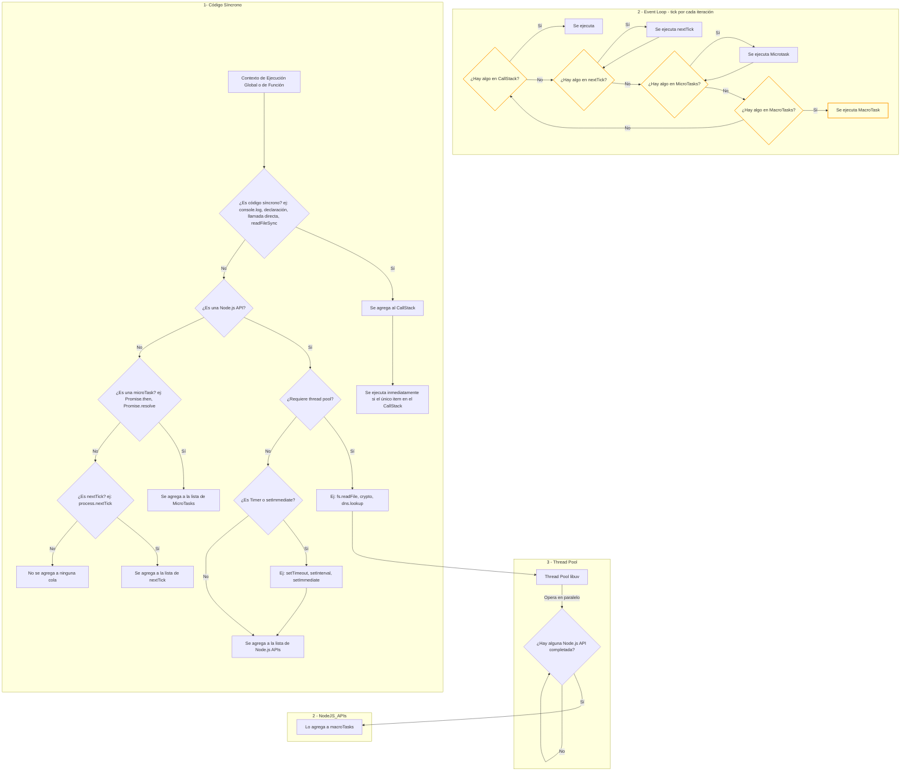

## Notas sobre microtasks, macrotasks y thread pool en Node.js

- **Microtasks**: Promises (`Promise.then`, `Promise.resolve`), pero en Node.js también existen las tareas de `process.nextTick`, que tienen prioridad sobre las microtasks estándar.
- **Macrotasks**: Timers (`setTimeout`, `setInterval`), I/O callbacks (`fs.readFile`, etc), `setImmediate`.
- **Thread Pool**: Solo operaciones como `fs.readFile`, `crypto.pbkdf2`, `dns.lookup` (no-cached) se delegan al thread pool de libuv si no pueden ser asíncronas a nivel de sistema operativo. Timers y setImmediate NO usan el thread pool. Cuando terminan, notifican al event loop y su callback se agrega a la cola de macrotasks.
- El event loop de Node.js ejecuta primero todas las tareas de nextTick, luego las microtasks, y después una macrotask.

### Ejemplo:

```js
console.log('A');
setTimeout(() => console.log('B'), 0); // macrotask
setImmediate(() => console.log('C')); // macrotask
Promise.resolve().then(() => console.log('D')); // microtask
process.nextTick(() => console.log('E')); // nextTick
fs.readFile('archivo.txt', () => console.log('F')); // thread pool + macrotask
console.log('G');
```

// Orden de impresión: A, G, E, D, B/C, F (el orden de B, C y F puede variar)

```

### En el diagrama:
- El código síncrono se ejecuta primero (va al CallStack).
- Las tareas de process.nextTick se ejecutan antes que las microtasks (Promises).
- Las microtasks (Promises) se ejecutan antes que las macrotasks.
- Las macrotasks incluyen Timers, I/O y setImmediate.
- El thread pool opera en paralelo y notifica al event loop solo para operaciones como fs.readFile, crypto, dns.lookup.
