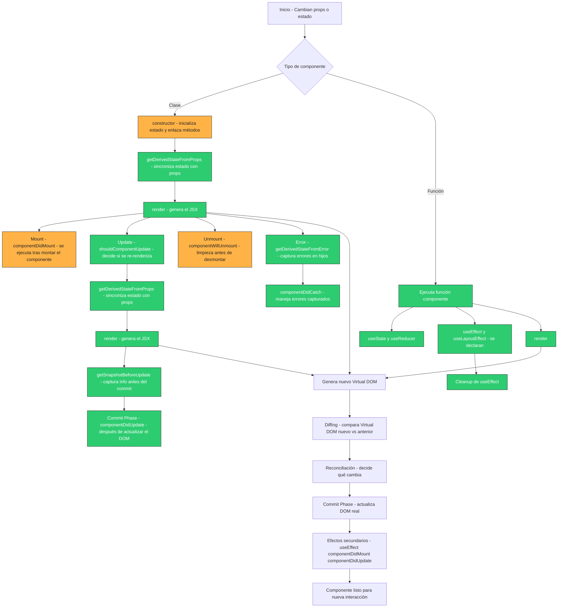

```mermaid
flowchart TD
A[Inicio - Cambian props o estado] --> B{Tipo de componente}

%% Rama Clase
B -- Clase --> C1[constructor - inicializa estado y enlaza métodos]
C1 --> C2[getDerivedStateFromProps - sincroniza estado con props]
C2 --> C3[render - genera el JSX]
C3 --> C4[Mount - componentDidMount - se ejecuta tras montar el componente]
C3 --> D1[Update - shouldComponentUpdate - decide si se re-renderiza]
D1 --> D2[getDerivedStateFromProps - sincroniza estado con props]
D2 --> D3[render - genera el JSX]
D3 --> D4[getSnapshotBeforeUpdate - captura info antes del commit]
D4 --> D5[Commit Phase - componentDidUpdate - después de actualizar el DOM]
C3 --> E1[Unmount - componentWillUnmount - limpieza antes de desmontar]
C3 --> F1[Error - getDerivedStateFromError - captura errores en hijos]
F1 --> F2[componentDidCatch - maneja errores capturados]

%% Rama Función
B -- Función --> G1[Ejecuta función componente]
G1 --> G2[useState y useReducer]
G1 --> G3[useEffect y useLayoutEffect - se declaran]
G3 --> G4[Cleanup de useEffect]
G1 --> G5[render]

%% Flujo Virtual DOM
C3 & D3 & G5 --> H1[Genera nuevo Virtual DOM]
H1 --> H2[Diffing - compara Virtual DOM nuevo vs anterior]
H2 --> H3[Reconciliación - decide qué cambia]
H3 --> H4[Commit Phase - actualiza DOM real]
H4 --> H5[Efectos secundarios - useEffect componentDidMount componentDidUpdate]
H5 --> I[Componente listo para nueva interacción]

%% Colores
style C1 fill:#ffb347,stroke:#222,stroke-width:1px,color:#222
style C4 fill:#ffb347,stroke:#222,stroke-width:1px,color:#222
style E1 fill:#ffb347,stroke:#222,stroke-width:1px,color:#222

style C2 fill:#2ecc71,stroke:#222,stroke-width:1px,color:#fff
style C3 fill:#2ecc71,stroke:#222,stroke-width:1px,color:#fff
style D1 fill:#2ecc71,stroke:#222,stroke-width:1px,color:#fff
style D2 fill:#2ecc71,stroke:#222,stroke-width:1px,color:#fff
style D3 fill:#2ecc71,stroke:#222,stroke-width:1px,color:#fff
style D4 fill:#2ecc71,stroke:#222,stroke-width:1px,color:#fff
style D5 fill:#2ecc71,stroke:#222,stroke-width:1px,color:#fff
style F1 fill:#2ecc71,stroke:#222,stroke-width:1px,color:#fff
style F2 fill:#2ecc71,stroke:#222,stroke-width:1px,color:#fff

style G1 fill:#2ecc71,stroke:#222,stroke-width:1px,color:#fff
style G2 fill:#2ecc71,stroke:#222,stroke-width:1px,color:#fff
style G3 fill:#2ecc71,stroke:#222,stroke-width:1px,color:#fff
style G4 fill:#2ecc71,stroke:#222,stroke-width:1px,color:#fff
style G5 fill:#2ecc71,stroke:#222,stroke-width:1px,color:#fff
```
