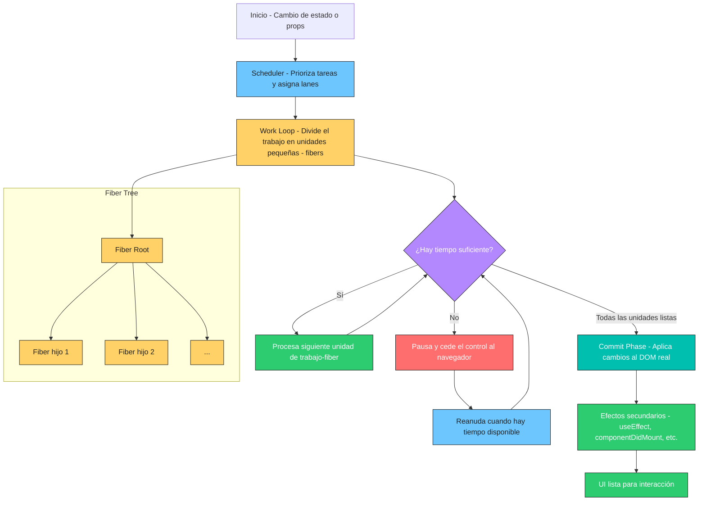

# react_fiber_architecture_and_concurrent_rendering

> **Nota:** Este diagrama ilustra cómo React Fiber divide el trabajo de actualización en pequeñas unidades (fibers), prioriza tareas, permite la concurrencia y el scheduling, y cómo esto impacta el proceso de reconciliación y commit.

