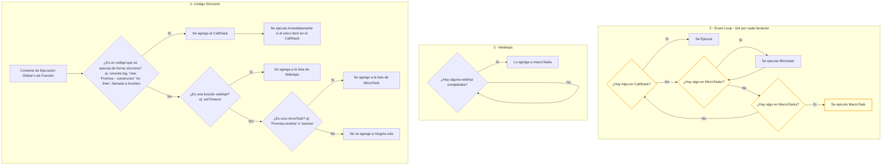

## Notas sobre async/await

- Cuando se declara una función con `async`, el código dentro de la función se ejecuta de forma síncrona hasta el primer `await`.
- Al llegar a un `await`, la ejecución de la función se pausa y el resto del código después del `await` se coloca en la cola de microtasks (igual que un `.then` de una Promise).
- Esto significa que el código después del `await` se ejecutará cuando el call stack esté vacío y antes de las macrotasks.
- Ejemplo:

```js
async function ejemplo() {
  console.log("A"); // Síncrono
  await null; // Pausa aquí, lo siguiente es una microtask
  console.log("B"); // Microtask
}
ejemplo();
console.log("C"); // Síncrono
```

// Orden de impresión: A, C, B

```

### En el diagrama:
- El `async` ejecuta el código hasta el primer `await` como código síncrono (va al CallStack).
- El `await` genera una microtask (como un `.then`).
- El resto de la función después del `await` se ejecuta en la fase de microtasks del Event Loop.
```
