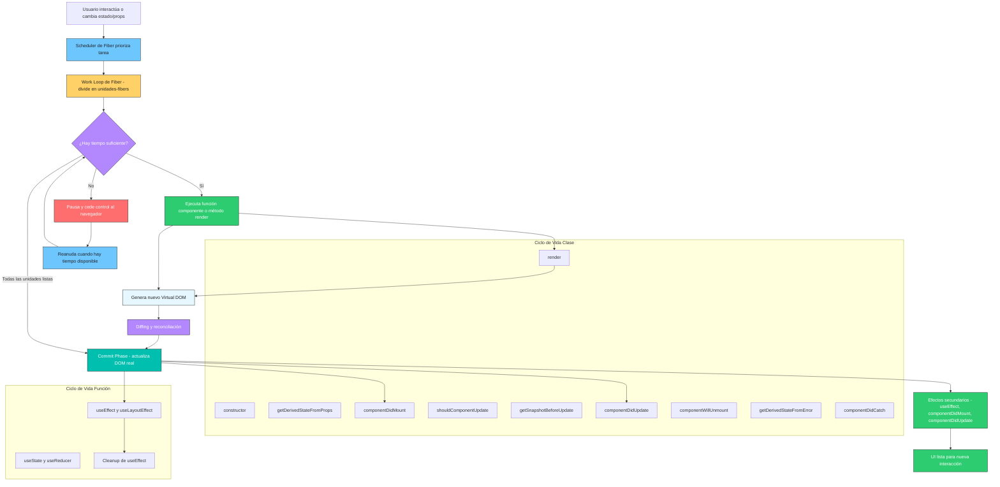

# react_fiber_lifecycle_and_reconciliation_combined

> **Nota:** Este diagrama integra el ciclo de vida de componentes, el flujo de reconciliación y commit, y el rol de React Fiber como scheduler y work loop concurrente.

